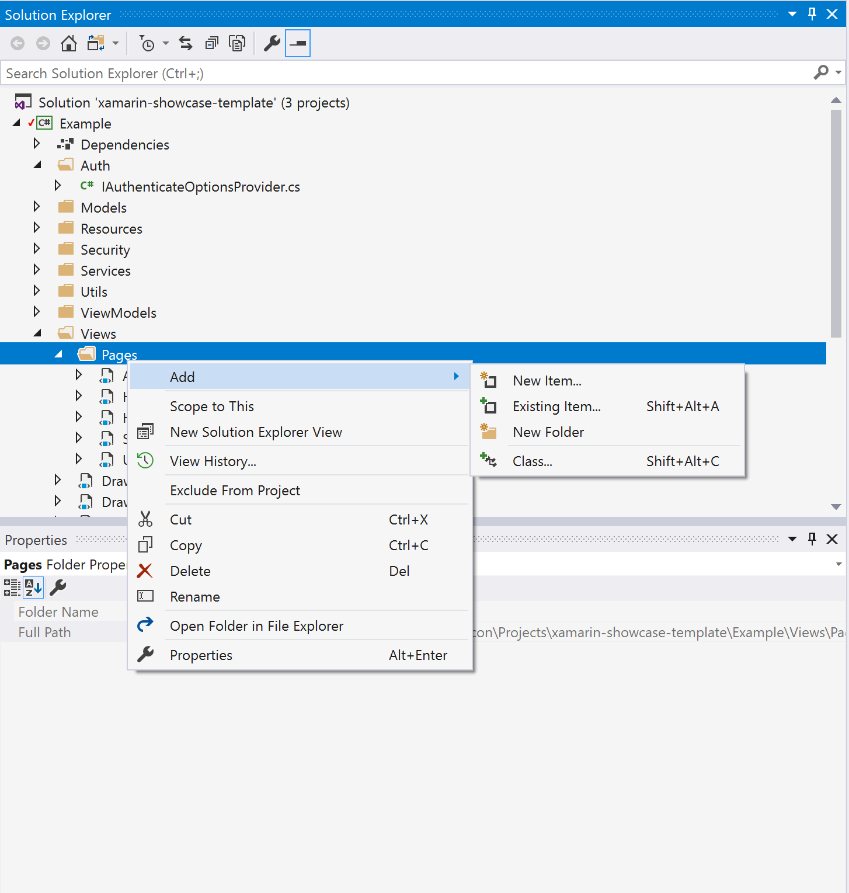
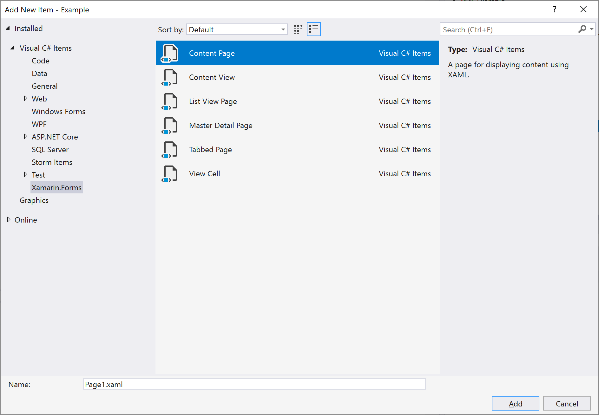

== How to add a view to the Xamarin Template

The Xamarin Showcase app is built on top of the link:https://docs.microsoft.com/en-us/xamarin/xamarin-forms/app-fundamentals/navigation/master-detail-page[Xamarin Forms Master-Detail template].  If you are not familiar with Xamarin Forms or their MVVM pattern you may wish to review link:https://docs.microsoft.com/en-us/xamarin/xamarin-forms/[their documentation].  

This guide walks you thought adding a page to the template application.

=== Prerequisites and setup

To use this guide you must have Visual Studio Community with Xamarin support installed on your computer.  This can be found on link:https://www.visualstudio.com[https://www.visualstudio.com].  

Once you have installed Visual Studio, clone https://github.com/aerogear/xamarin-showcase-template and open the xamarin-showcase-template.sln file to open the project in Visual Studio.

Once your project is open, restore the nuget packages by right clicking on the solution in the "Solution Explorer" pane and selecting "Restore NuGet Packages".

=== Add an item to the menu

To add an item to our drawer menu we have to add the image and string resources, code them in the link:https://github.com/aerogear/xamarin-showcase-template/blob/master/Example/ViewModels/DrawerMenuVM.cs[DrawerMenu View Model], and then create a page for them to view.

==== Add resources

First, edit link:https://github.com/aerogear/xamarin-showcase-template/blob/master/Example/Resources/StringResources.resx[StringResources.resx] to include the page title of your page.  Near the bottom of the file are existing entries for Home, Security, Auth, etc.  Use one of these as a template for the menu item for the page you want to add.  Select an icon in SVG format you wish to add and place it in the directory alongside StringResources.resx.

==== Add a blank page

Second, create a "Context Page" for the drawer menu to link to. In Visual Studio right click on the 'Pages' folder in Example/Views in Solution Explorer and then select "Add" -> "New Item" from the menu. Select the "Content Page" template from the Xamarin.Forms item in the dialog tree.  Give it a name and click "Add"; this creates the XAML view and its C# code behind.

==== Add a menu item

Finally, add the menu item to the drawer menu.  Open the DrawerMenuVM.cs file found in Example/ViewModels and add your item following the pattern in the constructor.
[source, c#]
---
 NavigationItems = new ObservableCollection<NavigationItem>(new[]
            {
                NavigationItem.HOME_PAGE,
                new NavigationItem { Id = 1, Title = StringResources.NavHttp, TargetType=typeof(HttpPage),Icon=ResourceUtils.GetSvg("ic_http") },
                new NavigationItem { Id = 2, Title = StringResources.NavAuth, TargetType=typeof(AuthPage),Icon=ResourceUtils.GetSvg("ic_auth") },
                new NavigationItem {Id = 3, Title = StringResources.NavSecurity, TargetType=typeof(SecurityCheckPage), Icon=ResourceUtils.GetSvg("ic_phonelink_lock")}
                /*new NavigationItem {Id = 4, Title = StringResources.$MyNewPageTitle, TargetType=typeof($MyNewPage), Icon=ResourceUtils.GetSvg("$my_svg_icon")}*/
            });
---

==== Confirm your page works

Run your app in iOS and Android and navigate from the drawer to your new page.  If this works, the page is ready for adding functionality.

=== Adding Functionality

==== View Models and ViewBinding

Xamarin.Forms uses a Model-View-ViewModel pattern as well as XAML with ViewBinding to implement UIs for its applications.  A full description of this is outside of the scope of this document, but basically any property in the code behind class can be referenced from the XAML document using a binding expression.

For Example 
[source, xml]
---
<TextCell Text="{Binding Name}" TextColor="{Binding DisplayColor}"/>
---

Name and DisplayColor would be properties of the codebehind object.

Additionally, if you are using a collection, you can traverse the Binding in intuitive ways.

[source, xml]
---
<ListView x:Name="checkList" ItemsSource="{Binding CheckResults}">
    <ListView.ItemTemplate>
        <DataTemplate>
            <TextCell Text="{Binding Name}" TextColor="{Binding DisplayColor}"/>
        </DataTemplate>
    </ListView.ItemTemplate>
</ListView>
---

In this example the Name and DisplayColor Bindings are referencing items in the List from the CheckResults binding which is a property in the SecurityCheckPage's code behind.

==== Platform Specific Code

There are many ways to access platform specific code.  The easiest way is to define an interface in your common code, implement and register the interface in your platform specific code, and then use some lookup mechanism to get a reference to the platform implementation in your common code.  In this project we use link:https://docs.microsoft.com/en-us/xamarin/xamarin-forms/app-fundamentals/dependency-service/[Xamarin's Dependency Service] to provide the registration and lookup mechanisms.  For references please look at the provider classes in Example.iOS and Example.Android.

=== Troubleshooting

If you have problems, feel free to reach out to us on our link:https://groups.google.com/forum/#!forum/aerogear[Google Group] or #aerogear on FreeNode IRC.
